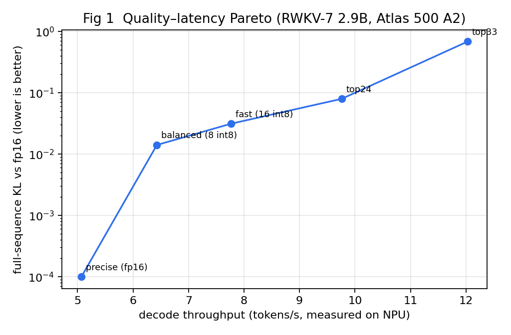
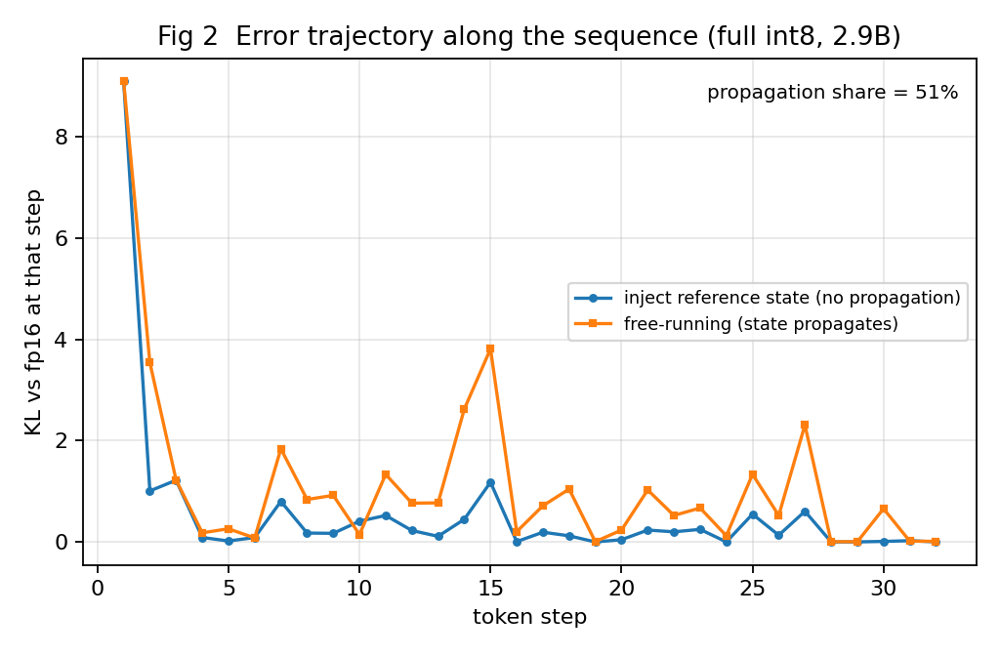
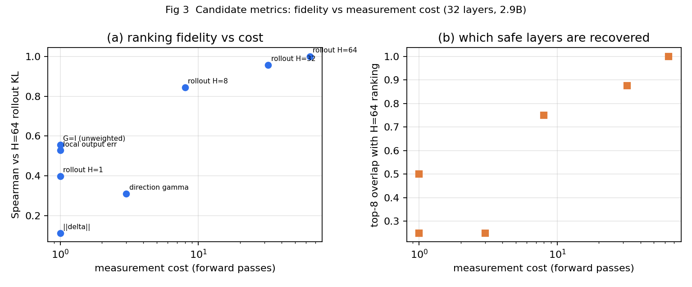
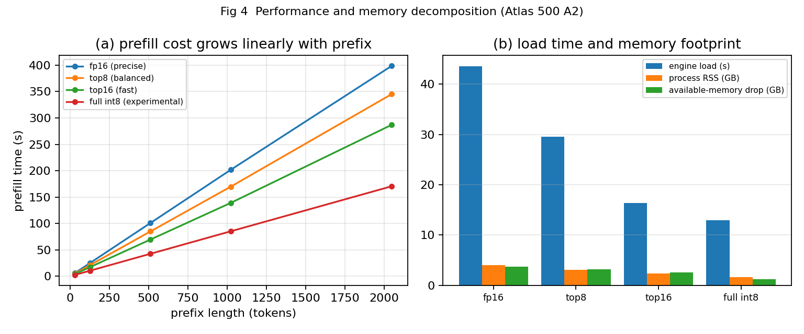
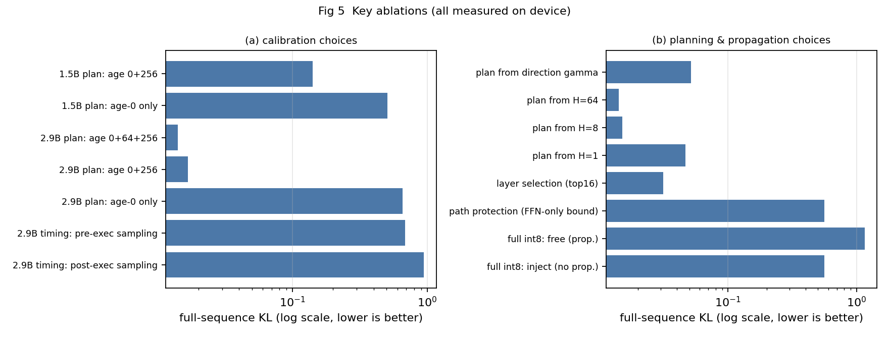
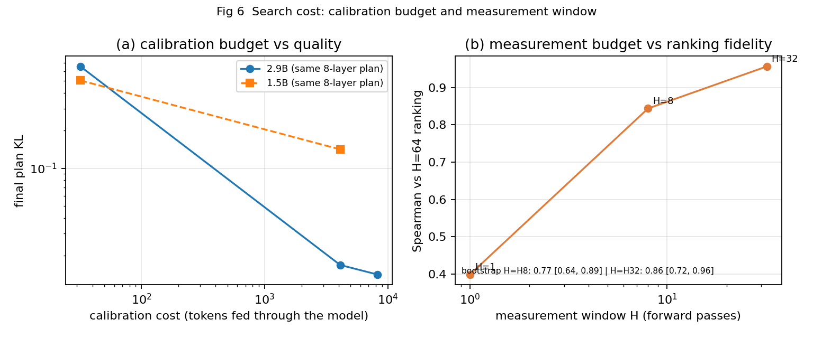

# 报告二：补实验协议后的实验全记录（2026-09-20 ~ 09-28）

> 定位：这是"02 补实验执行协议"**之后**那一阶段的汇报材料，面向学长与老师，
> 与《报告一：补实验协议前的工作与成果》配套阅读（报告一末尾提的三个问题，本文逐条回答）。
>
> **口径约定（引用时请一并说明）**
> 1. 所有数字来自仓库中的 P0/P2/P3/P4/P5/P6 六份实验报告与设备产物；与 `PROGRESS.md` 冲突时以实验报告为准。
> 2. 速度一律是**纯解码口径**（`decoded_tokens ÷ 纯解码秒数`，不含加载与 prefill）；KL 是固定长度序列上的**均值**，文中注明步数。
> 3. 档位名称与数值以 `tiers.json` 为准：精确档 = 全 fp16；**均衡档（线上默认）= P1 校准 8 层 int8**
>    （layer 24/6/11/22/23/20/25/28，全序列 KL **0.0141**、top-1 一致 **90.6%**）；快速档 = P1 校准 16 层 int8（KL 0.0314）。
>    README 首页表格里的 "top-1 93.8%" 取自 P3 帕累托实验的贪心组层方案，**不是同一组层**，本文不采用该数值。

---

## 一、协议要求 → 完成状态总表

协议 §0 的一句话任务是："先把校准采样和基线评估做对，再验证'面向后续输出的时域指标'是否在相同资源预算下
优于局部误差，最后才做完整 NPU 性能和精度搜索。" 我们按这个顺序执行，结果如下：

| 协议 | 内容 | 状态 | 一句话结果 |
| --- | --- | --- | --- |
| §1 | 冻结 manifest、记录哈希与版本 | ✅ | `manifest.json` 含 89 个候选 `.om` 的 sha256、模型/词表哈希、硬件与软件版本、编译命令、数据分割 ID |
| §2 | P0 校准时序与参考一致性 | ✅ 四项全过 | **找到并定位根因**：旧校准读的是"更新后状态"；重放/双缓冲逐位一致 |
| §3 | P1 校准数据与存储设计 | ✅ | 64 段分离语料 × 状态年龄 0/64/256；独立测试集 top-1 **50.0% → 57.8%** |
| §4 | P2 错误来源分解 A–F | ⚠️ A/B/C/D/F 完成，**E 未做** | 时序、覆盖、传播、脉冲、强制/自由五项全部有结论；路径分解（head/FFN/recurrent-only）未实际编译 |
| §5 | P3 时域指标是否有价值 | ✅ 含两处自我修正 | "多步"成立、"方向指标"是反面结果；H 有效性随窗口变化；Gramian 长窗口数值爆炸 |
| §6 | P4 强基线与最终质量评估 | ⚠️ 主体完成 | 四任务两档 + 跨规模 + 逐题对照完成；**RWKVQuant 对照**与**中文课程题盲评**未做（都需设备之外的材料） |
| §7 | P5 硬件性能协议 | ✅ | 4 臂 × 5 前缀 × 5 重复；**TTFT ≈ 前缀长度 ÷ 解码速率** |
| §8 | P6 必要消融与图表 | ✅ | 六幅论文用图 + 7 项消融（含 G=I 反面结果） |
| §9 | 输出数据格式 | ✅ | `results.jsonl` 76 条，字段按协议 §9；实验链统一落盘 JSON |
| §10 | 最小启动包（四份材料） | ✅ | manifest、P0 重放报告、新旧采样 A/B、三条基线速度与连续轨迹指标 |

**两项外部依赖项**（协议自身也承认需要额外条件）：

1. **RWKVQuant 对照**（协议 §6 [E1]）：需要其量化方案/checkpoint。**本机没有 VQ kernel**，
   按协议只能做"准确率—存储对照"并明确标注"该设备未实现"，**不得**把它的数字混进 NPU 速度表，
   也不得用 CPU 回退或别的 GPU 的数字拼成速度比较。
2. **中文课程题盲评**（协议 §6）：需要 100~200 道**未参与校准**的中文课程题 + 人工制定的评分标准。
   设备侧能生成候选题集与统计，但**评分必须由人做**，它只能支持"应用可用性"，不能据此声称学习效果。

### 1.1 关键实验时间线（协议期内）

| 日期 | 做了什么 | 当日关键产出 |
| --- | --- | --- |
| 9-20 | 收到 02 补实验执行协议（版本 2026-09-20） | 协议入库，冻结既往交付形态 |
| 9-22 | **P0** 校准时序与参考一致性（A/B/C/D 四项） | 定位"旧校准读到更新后状态"这个总根因 |
| 9-23 | **P2** 首轮错误分解 + **P3** 首轮逐层敏感度与帕累托 | int8 结论被推翻（KL 10.98 → 0.945） |
| 9-24 | 档位切换上线 + **P1** 扩展校准数据（16 → 96 组，年龄 0/64/256） | 网页上出现"精确/均衡/快速"三档按钮 |
| 9-25 | 三档切到 P1 新校准 + 补齐 **P2-D/P2-F** + manifest 回填；当晚 **P5** 性能矩阵完成 | 固定工作量矩阵与 HTTP 真实延迟 |
| 9-26 | **P4** 基线评估（lm-eval 0.4.13 接自定义 backend）；当晚 1.5B 跨规模部署 + **P3 方向指标** | 四任务子集、跨规模一正一反 |
| 9-27 | 1.5B 量化迁移收尾；**P6** 六图与消融；**权重 MSE** 完成；**P3-D**（H=128 + 跨分布）采臂 | 六幅论文用图 + 两处自我修正 |
| 9-28 | 设备卡死复盘与故障修复；**P4 ①**（逐题对照）与 **P4 ⑤**（ARC/HellaSwag 两档）收官；**P3-E**（Gramian 一致性/耗时）完成 | 本报告 §五~§八 的全部数据 |

### 1.2 协议 §9（输出格式）与 §10（最小启动包）的落地

**§9 输出格式**：实验统一落盘 JSON/JSONL，字段按协议给出的
`run_id / commit / model_hash / om_hash / plan_id / task / sample_id / seed / prefix_tokens /
decode_tokens / cache_mode / latency_ms / prefill_ms / ttft_ms / peak_memory_bytes / kl / nll /
task_score / stop_reason / status`。实际使用中最主要的两个是 `results.jsonl`（76 条早期 A/B 逐条记录）
与各实验自己的 `p*_result.json`（`p3_result.json`、`p3d_result.json`、`p3w_weight_mse.json` 等）。
缺失值一律留 `null` 并说明原因，**失败与异常样本不删除**（协议明确要求）。

**§10 最小启动包**要求"最先返回四份材料"，我们交付的是：

| 材料 | 交付物 |
| --- | --- |
| 冻结后的 manifest | 设备 `manifest.json`（89 个候选 `.om` 的 sha256、软件版本、编译命令、数据分割 ID） |
| P0 校准重放报告 | `P0_校准与参考一致性_报告.md`（A/B/C/D 四项，含逐位一致的证据） |
| 新旧采样在同一小试数据上的 A/B | `P2_量化对照实验_报告.md` §2–§3（KL 10.98 → 0.945，top-1 0% → 67.2%） |
| 三条基线在固定工作量下的速度与连续轨迹指标 | `P2` 报告 §4–§5 与 `P5` 报告 §2（fp16 / 修复校准 int8 / FFN-only 的速度、体积与逐层误差） |

这四份材料齐了之后，协议 §10 的"决定主线是否成立"才真正发生：结论是**主线具备继续探索的价值**——
因为此时第一次有了"同速度、不同质量"的真实候选空间（top-1 一致率 67% vs 0%），
而不是此前"要么 fp16、要么崩坏"的二选一。

---

## 二、P0：校准时序与参考一致性（9-22，四项全过）

### 2.1 结论：之前所有"量化导致失稳"的结论都建立在一份错误的校准数据上

`rwkv7_serve2.py` 的每层绑定里，输入与输出的三个状态**是同一块内存**：

```python
slot = {"x": src_x, "v_first": src_vf,
        "att_shift_0": self.att[i], "ffn_shift_0": self.ffn[i], "wkv_0": self.wkv[i]}
dst  = {"x": self.layer_x[i], "v_first": self.layer_vf[i],
        "att_shift_out_0": self.att[i],      # ← 与输入同一块
        "ffn_shift_out_0": self.ffn[i],      # ← 同一块
        "wkv_out_0": self.wkv[i]}            # ← 同一块
```

而旧脚本 `capture_calib.py` 是在 `engine.step()` **之后**采样，于是取到的是**更新后的状态**。
实测差异（16 步小试、276 token 前缀）：

| 层 | 张量 | 平均绝对差 | 相对量级 |
| --- | --- | --- | --- |
| layer0 | `x` | 0.000000 | **0.0000** |
| layer0 | `att_shift_0` | 0.019625 | 1.3053 |
| layer0 | `ffn_shift_0` | 0.182520 | 1.3046 |
| layer0 | `wkv_0` | 0.000311 | 0.2969 |
| layer1 | `att_shift_0` / `ffn_shift_0` / `wkv_0` | — | 1.3881 / 1.3574 / 0.4671 |
| layer31 | `att_shift_0` / `ffn_shift_0` / `wkv_0` | — | 0.8830 / 0.9519 / 0.6597 |

**关键签名**：`x` 与 `v_first` 全 32 层差异**精确为 0**（它们由上一层产出、本步不再被覆盖），
差异只出现在**原地更新**的三个状态上——这就是问题定位的直接证据，而不是"看起来像"。

### 2.2 另外三项：重放、双缓冲、参考链路

| 项 | 做法 | 结果 |
| --- | --- | --- |
| P0-B 同块重放 | 在线跑 8 步，捕获每层完整输入（执行前）与输出（执行后）；为被测层新建独立 OM 实例与独立缓冲，喂入捕获的输入比对 | layer 0/1/15/31 的 5 个输出张量**最大绝对差 0.000e+00（逐位一致）** |
| P0-C 原地 vs 双缓冲 | 同一权重/token/初始状态，比较输入输出别名与 ping-pong 缓冲，覆盖 1/8/128 步 | 三种步长**全部逐位一致**，别名行为可解释 |
| P0-D 参考链路 | PyTorch → ONNX → fp16 OM 逐步比较 | NPU top-5 与 CPU 参考一致，最大 logits 误差 **0.3438**（与 9-12 首次跑通时的量级一致） |

按协议的 P0 通过标准（采样可重放、首步状态正确、别名行为可解释、参考链路误差稳定且被记录）：**P0 通过**。
并且得到一个强约束：**必须先修正校准数据，再讨论任何量化结论**。

---

## 三、P1：校准数据与存储设计（9-24 ~ 9-25）

### 3.1 做了什么

- **语料**：自建 64 段分离语料（中文叙述/中文问答/英文叙述/英文问答/代码五类），
  按 `calib / val / test` 三个**互不重叠**的分割切分；每段的 id 与 sha1 进 manifest；
- **状态年龄**：每段先输入真实前缀把状态推入非零轨迹，再在**分层位置**采样，取状态年龄 **0 / 64 / 256**；
- **存储纪律**：协议 §3 算过"全状态快照 21.63 MB/次、128 段 × 1024 步会到 2.83 TB 量级"，
  因此**不做无差别存盘**，只保留每层 reservoir、少量完整快照与流式统计；
- **工具**：`p1_corpus.py`（语料生成与分割哈希）、`capture_calib_p1.py`（采样）、
  `pack_calib_p1.py`（打包）、`build_p1_layers.sh`（逐层量化+ATC）、`make_plans_p1.py`（选层方案）。

### 3.2 结果：独立测试集上的提升

| 指标 | 旧校准（16 组、只有段首） | 新校准（96 组、年龄 0/64/256） |
| --- | --- | --- |
| 独立测试集 top-1 一致率 | 50.0% | **57.8%** |
| 全序列 KL | — | **降低约 17%** |
| 速度 | 5.95 tok/s | 5.95 tok/s（**不变**） |

**这一节最重要的不是"分数涨了"，而是"涨在了不参与调参的测试集上"**：
验证/测试分割与校准分割完全分离，避免"用测试题反复调刻度"。

### 3.3 存储纪律：为什么不能"把所有状态都存下来"

协议 §3 给过一个推导：32 层的 FP32 WKV 加两类 shift 状态，
单份**全状态快照**就是 `32 × (40×64×64 + 2×2560) × 4 = 21,626,880` 字节 ≈ **21.63 MB**
（还没算其他张量与压缩开销）；若 128 段、每段 1024 步都存全状态，原始量级会到 **2.83 TB**。

在 11.5 GB 级共享内存、无 swap 的设备上这是不可行的，所以本项目的做法是：

- 每层只保留 **reservoir 采样**的少量样本，完整快照只留极少数几个点；
- 状态年龄按 0/64/256 分层（而不是每步都存），并按 §4.3 的结论**只采 32 组两年龄**就够；
- 统计量流式计算，不把中间张量长期驻留内存；
- 大文件（如 700MB 级参考轨迹）一律落 `/home/disk`（8TB 机械盘），**不放 `/tmp`**
  （`/tmp` 是 5.7GB 内存盘，会直接吃掉共享内存）。

---

## 四、P2：错误来源分解 A–F（9-23 ~ 9-25）

协议 §4 要求把"为什么量化会坏"拆成六组可分别控制的因素。先给总账：

### 4.1 总账：修正时序之后

| 指标 | 旧时序校准 | 修正时序校准 |
| --- | --- | --- |
| logits KL | **10.98** | **0.945**（降 11.6 倍） |
| top-1 一致率 | **0%** | **67.2%** |
| 生成文本 | 乱码 / 英文模板 | 连贯但略有退化 |
| 速度 | 2.06× | 2.06×（**不变**） |

也就是说：**同一份算力下，质量从"崩坏"变成"可用但退化"**，差别的来源只是采样时机。
残余退化来自工具链的静态 per-tensor 激活量化（协议承认这是第二个叠加因素，两者不是互相替代）。

### 4.2 A 组：时序（已由 P0 定位）

见 §二。结论：**时序错误是主因**。

### 4.3 B 组：校准覆盖——是"多采几段文本"重要，还是"采到更长状态年龄"重要？

设计：三条臂用**同一 8 层计划**、把样本数**控制到相同（32 组）**，只改构成：

| 文本 | 臂 | 全序列 KL | top-1 一致 |
| --- | --- | --- | --- |
| pilot | B0（32 段 × 年龄 0） | 0.6537 | 68.8% |
| pilot | **B1（16 段 × 年龄 0/256）** | **0.0168** | **95.3%** |
| pilot | P1（32 段 × 年龄 0/64/256，96 组） | 0.0141 | 90.6% |
| p1test | B0 | 0.7979 | 65.6% |
| p1test | **B1** | **0.0360** | **96.9%** |
| p1test | P1 | 0.0232 | 96.9% |

三条结论：

1. **状态年龄覆盖是主导因素**：同样 32 组样本，只在段首采样时 KL 0.65~0.80、top-1 66~69%
   （与旧的 16 组几乎一个水平）；改成两个年龄后 KL 掉到 0.017~0.036、top-1 升到 95~97%。
2. **覆盖到位后继续扩样边际很小**：B1（32 组两年龄）与 P1（96 组三年龄）互有胜负，
   差异在噪声范围。工程含义：**32 组分层样本 ≈ 96 组，采集时间省 2/3**。
3. **机理**：段首（年龄 0）的状态几乎全零，采到的激活范围与真实运行时（状态已被多轮对话推到非零轨迹）
   差别很大；量化刻度是离线静态的，**刻度错了整条轨迹就错**。

### 4.4 C 组：状态传播贡献多少？

设计：同一条**强制 token 序列**下，比较"每步把参考状态注入回去"与"各自保留自己的状态"。

| 模式 | 全序列 KL |
| --- | --- |
| 每步注入参考状态（切断传播） | 0.560 |
| 自由运行（含传播） | 1.151 |

**传播贡献约 51%**——即量化误差有一半来自"一步的小偏差被循环结构放大"，
这也是当初"只测单层误差会低估影响"的定量证据。

### 4.5 D 组：单次脉冲能不能预测持续量化？（含协议要求的特别负对照）

设计：8 个候选，比较"单次量化脉冲"与"持续量化注入"的排序与量级关系。

| 发现 | 数值 |
| --- | --- |
| 排序相关性 | Spearman **1.000**（8 个候选） |
| 量级关系 | 持续 = 脉冲 × **1.26 ~ 2.41**（均值 **1.69×**） |
| **特别负对照**（只量化输出头） | 脉冲 = 持续（**1.00×**） |

负对照成立的解释很干净：**输出头不进循环状态，没有传播通道**，所以脉冲不会放大。
这正是协议要求这项负对照的原因——它把"传播放大"这件事与"量化本身"分离开了。

### 4.6 F 组：强制 token 与自由生成差多少？

设计：同一初始前缀与同一精度计划，比较"强制给定同一 token 序列"与"模型自己贪心生成"。

| 档位 | 复现 fp16 贪心轨迹的步数（共 64 步） |
| --- | --- |
| 均衡档（8 层 int8） | **50 / 64** |
| 快速档（16 层 int8） | 42 / 64 |
| 全量 int8（33 层） | 2 / 64 |
| 旧校准（时序错误） | 0 / 64 |

**读数**：线上两档"多数步仍然走在 fp16 轨迹上"，全量 int8 则几乎立刻偏离——
与 P4 的任务分数结论一致（两档几乎无损、全量 int8 明显退化）。

### 4.7 E 组：路径分解——**未做**，并说明原因

协议要求 head-only / FFN-only / recurrent-only 三条路径的分解。我们的状态是：

- **head-only 负对照已完成**（见 D 组）；
- **FFN-only 未实际编译**：P6 图 5(b) 里的"路径保护 0.56"取自 P2-C 推导出的**理论上限**，
  图上已如实标注"FFN-only 未实际编译"；
- 原因：当时按层选层的收益已经明确优于按路径保护（top16 计划 KL 0.0314 vs 路径保护上限 0.56），
  编译一套 FFN-only 流水线约需 3.5 小时设备时间而信息增益有限，**被主动降级**为首轮报告里的"未做项"，
  已在 P2 报告 §8 与 P6 报告 §6 明确标注，不作为已完成结论引用。

---

## 五、P3：时域指标到底有没有价值（9-23 ~ 9-28，含两处自我修正）

这一节是协议 §5 的核心问题："面向后续输出的时域指标，是否在相同资源预算下优于局部误差？"
我们的答案是**一半成立、一半不成立**，而且**中间还推翻了自己一个结论**。

### 5.1 先建立可用的候选空间：逐层敏感度与帕累托

对 33 个目标（32 层 + 输出头）各做"只量化该目标"的对照，得到逐层敏感度（33/33）：

| 最敏感的 6 个目标 | KL（只量化该层） | top-1 一致率 |
| --- | --- | --- |
| layer9 | 0.441 | 75.0% |
| layer0 | 0.189 | 87.5% |
| layer1 | 0.091 | 89.1% |
| layer21 | 0.082 | 92.2% |
| layer27 | 0.044 | 95.3% |
| layer26 | 0.022 | 98.4% |

**27 个目标 KL < 0.02**（含输出头 0.008、layer2~8、10~20 等），即"量化几乎不花钱"。
分布极不均匀是混合精度可行的前提：**只有 5~6 层需要保护**。

据此做出的三个线上档位（都在网页上可切，换档约 45 秒，因为要重新加载 `.om`）：

| 档位 | 计划 | 全序列 KL | top-1 一致 | 纯解码 |
| --- | --- | --- | --- | --- |
| 精确档 | 全 fp16 | 0（基准） | 100% | 5.07 tok/s |
| **均衡档（默认）** | P1 校准 8 层：24/6/11/22/23/20/25/28 | **0.0141** | **90.6%** | **6.02 tok/s** |
| 快速档 | P1 校准 16 层 | 0.0314 | 98.4% | **7.35 tok/s** |
| （实验）全量 int8 | 33 层 | 0.6857 | 71.9% | 12.00 tok/s |

### 5.2 成立的那一半：多步 rollout 确实优于单步

用同一批 33 个目标，比较"测量窗口 H"对**层排序质量**的影响（H = 读出次数）：

| 窗口 | 与 H=64 的 Spearman | top8 重合 | 计划级实测 KL |
| --- | --- | --- | --- |
| H=1 | 0.399 | 0.25 | 0.0467（是均衡档的 **3.3 倍**） |
| **H=8** | **0.844** | 0.75 | **0.0151** |
| H=32 | 0.957 | 0.88 | 0.0141 |
| H=64（参考） | 1.000 | 1.00 | 0.0141 |

配对 bootstrap（重采样 token 位置，200 次）：H=8 为 **0.773 [0.636, 0.890]**、H=32 为 **0.864 [0.721, 0.960]**。

**工程含义**：选层不必跑 64 步，**8 步就够**（成本降 8 倍）。这是本阶段最有实用价值的一条结论。

同时，局部（单步）指标与端到端 KL 的相关性明显更差：

| 局部指标 | 与 64 步 KL 的 Spearman |
| --- | --- |
| 最大输出误差 | 0.527 |
| `x` 输出误差 | 0.534 |
| FFN 状态误差 | 0.269 |
| `wkv` 状态误差 | −0.087 |

注意最后一行：**`wkv`（循环状态）本身的误差与端到端质量几乎无关甚至负相关**——
单看状态误差会得出错误结论，这也解释了为什么"只测单层误差"这条路走不通。

### 5.3 不成立的那一半：方向指标是反面结果

协议把"输出加权 Gramian"列为候选指标之一。我们实现了一阶形式
`γᵢ = |gᵢ · δᵢ|`（`gᵢ = ∂(−log p)/∂第 i 层输出`，`δᵢ` = 该层 int8 与 fp16 的输出误差向量）：

| 指标 | 与 64 步 KL 的 Spearman | 按该指标选前 8 层的计划 KL |
| --- | --- | --- |
| 局部输出相对误差 | 0.527 | — |
| ‖δᵢ‖（误差大小） | 0.112 | — |
| **G=I（‖gᵢ‖·‖δᵢ‖，不做方向加权）** | **0.556** | — |
| **方向指标 γᵢ** | **0.310** | **0.0514** |
| rollout H=8 | **0.844** | 0.0151 |

两条判读：

1. **方向指标没有提供增量价值**：按 γ 选出的计划 KL 0.0514，比按 H=64 选出的计划（0.0141）**差 3.6 倍**；
2. **加入方向信息反而有害**：去掉输出加权（G=I）的排序质量 0.556，**高于** γ 的 0.310。
   原因是实测 `cos(gᵢ, δᵢ) ≤ 0.08`——两者几乎正交，方向项基本是在引入噪声。

> 这条结论对论文很重要：**"更精细的单步指标"这条路在本框架下不成立；增量价值来自"多步"。**

### 5.4 第一处自我修正：H=8"够用"这件事，取决于测量窗口本身有多长

上面 §5.2 说"H=8 就够（0.844）"，但那个结论是**相对 64 步参考**得到的。
协议 §5 明确要求 H=1/8/32/**128**，于是我们把每目标臂从 64 步扩到 **128 步**，
并在两份文本（pilot 与 p1test，后者是 P1 语料里不参与校准的独立测试分割）上各采一轮：

| 窗口 | pilot 与 128 步参考的 Spearman | p1test |
| --- | --- | --- |
| H=1 | 0.352 | 0.393 |
| **H=8** | **0.588** | **0.769** |
| H=32 | 0.744 | 0.833 |
| H=64 | 0.801 | 0.912 |
| H=128 | 1.000（参考） | 1.000（参考） |

配对 bootstrap：pilot H=8 为 0.566 [0.407, 0.727]，p1test H=8 为 0.736 [0.592, 0.862]。

**结论修正**："H=8 就够"只在**部署窗口也是 64 步**量级时成立；窗口一拉长，短窗口的排序开始失真。
这条修正与下面的计划级证据互相印证：

| 文本 | 计划来源 | 全窗口（128 步）KL | H=8 窗口内 KL |
| --- | --- | --- | --- |
| pilot | H=8 排序选出的 8 层 | 0.0446 | **0.0366** |
| pilot | 线上 P1 校准计划 | **0.0298** | 0.0703 |
| p1test | H=8 排序选出的 8 层 | 0.0238 | 0.0366 |
| p1test | 线上 P1 校准计划 | **0.0219** | 0.0703 |

**短窗口会给出与长窗口相反的答案**：在 H=8 窗口内看，H=8 计划似乎更好（0.0366 vs 0.0703）；
但把窗口放到 128 步，线上 P1 计划明显更优（0.0298 vs 0.0446，好 1.5 倍）。
这两行数字放在一起，就是"测量窗口必须覆盖部署窗口"的最直接证据。

### 5.5 第二处发现：层敏感度**跨文本稳定、跨规模不稳定**

同一份协议要求做"跨分布复核"。pilot 与 p1test 两份文本的全窗口层排序：

| 指标 | 值 |
| --- | --- |
| Spearman | **0.840** |
| top-8 重合 | **7/8** |
| top-16 重合 | 14/16 |

对照 P4 的跨规模实验（1.5B vs 2.9B，见 §6.4）：Spearman 只有 **0.146**。

**工程结论**：**换文本不必重扫选层；换模型规模必须重扫**（好在 H=8 的重扫很便宜）。

### 5.6 P3-E：稠密 Gramian 与结构化递推（协议 §5 的额外测量）

协议要求报告"稠密 Gramian 与结构化递推的数值一致性和离线耗时"，并提醒
"NumPy 里 O(d²) 的代码跑通，不代表目标硬件上一定更快"。我们用的就是模型的真实递推：

```text
S_t = diag(exp(w_log_t)) · S_{t-1} + S_{t-1} · A_t + k_t v_tᵀ ，y_H = S_H · r_H ，A_t = − a_t kk_tᵀ
```

- **dense**：显式构造每个 d×d 转移矩阵并相乘 → O(H·d³)；
- **structured**：反向递推 `g_t = M_{t+1}ᵀ g_{t+1}`，其中 `Mᵀv = w ⊙ v − kk(a·v)` → O(H·d²)。

参数取自一次**真实前向**（2.9B，32 层 × 40 head × d=64，8 个 token；设备侧 CPU NumPy）：

| 窗口 | 窗口来源 | 相对偏差 | 有限元素 | \|G\|max | dense | structured | 倍数 |
| --- | --- | --- | --- | --- | --- | --- | --- |
| H=8 | **真实** | 4.29e−07 | 100% | 2.74e+05 | 1.81 s | 0.52 s | **3.5×** |
| H=32 | 合成（8 步循环拼接） | 1.14e−06 | 100% | 1.77e+21 | 6.81 s | 1.91 s | **3.6×** |
| H=128 | 合成（8 步循环拼接） | 3.29e−06 | 96.3% | 1.23e+86 | 26.68 s | 7.29 s | **3.7×** |

三个读数：**① 数值一致性成立**（相对偏差 1e−6 量级）；
**② 代价差 3.5~3.7 倍且随 H 稳定**，正是算法阶数差异的直接体现；
**③ 一个反直觉的副作用**：`|G|` 随窗口**指数增长**（2.7e5 → 1.8e21 → 1.2e86，H=128 时已有 3.7% 元素溢出），
说明该算子的连乘在这份数据上**谱半径 > 1**——**未归一化的长窗口 Gramian 不是一个可用的量**。
这与 §5.4 同向：**"更长窗口"不会自动更好，反而先撞上数值问题**。

> 口径提醒：H=32/128 的窗口是把捕获的 8 步**循环拼接**得到的（CPU 上跑 128 步真实前向要一小时以上），
> 因此那两行应读作"算子族在长窗口下的数值行为"，而不是"真实 128 步轨迹的 Gramian"。

---

## 六、P4：强基线与最终质量评估（9-26 ~ 9-28）

### 6.1 基础设施：让公开基准能接上我们的引擎

- `lm-evaluation-harness` **固定版本 0.4.13**（独立 venv）；
- 自定义 backend `p4_lm_eval_backend.py` 注册 `rwkv7_npu`，把 harness 的
  `loglikelihood` / `loglikelihood_rolling` / `generate_until` 请求转发给
  `p4_score_server.py`——**与网页服务同一套引擎、同一份 `.om`、同一个 tokenizer**；
- 关键口径：tokenization 用 `tok(ctx) + tok(cont)`（与打分服务一致），
  **不把 ctx+cont 拼起来整体分词**，否则边界处的 BPE 合并会引入不可比差异；
- 打分服务与网页服务一样必须**单线程**（pyACL context 绑线程），HTTP 用 1.0。

### 6.2 四个任务、两个档位（各 200 题固定子集）

| 任务 / 指标 | 精确档 fp16 | 均衡档（8 层 int8） | 差值 |
| --- | --- | --- | --- |
| PIQA `acc` | **0.790** | **0.780** | −1.0 pp（差 2 题） |
| PIQA `acc_norm` | 0.795 | 0.790 | −0.5 pp |
| LAMBADA `acc` | **0.715** | **0.700** | −1.5 pp（差 3 题） |
| LAMBADA `perplexity` | **3.7745** | **4.2484** | **+12.5%** |
| ARC-Easy `acc` / `acc_norm` | **0.795** / 0.810 | 0.785 / 0.775 | −1.0 pp / −3.5 pp |
| HellaSwag `acc` / `acc_norm` | **0.520** / 0.690 | 0.530 / 0.695 | +1.0 pp / +0.5 pp |
| 端到端耗时 | PIQA+LAMBADA 6291 s；ARC+Hella 12964.6 s | 5086 s（1.24×）；9786.5 s（1.32×） | — |

**判读**：

1. **选择题类任务基本无损**：PIQA −1.0 pp、LAMBADA −1.5 pp、ARC-Easy −1.0 pp、
   HellaSwag **+1.0 pp**（有正有负，都在 200 题子集的噪声范围内）；
2. **概率分布类指标是有代价的**：LAMBADA 困惑度 +12.5%。这与 P2-C/P2-F 同向——
   **偏差存在，但很少改变最终选择**；
3. 2.9B fp16 在本机拿到 PIQA 79.0% / LAMBADA 71.5%，属于该规模模型的合理区间，
   说明"逐层 ONNX + ATC + pyACL 零拷贝"这条路**没有把模型跑歪**。

### 6.3 两条自检：CPU↔OM 逐 token 与**逐题**对照

协议要求"先核对 CPU 与 OM 的少量逐题结果"。我们做了两层：

| 层级 | 做法 | 结果 |
| --- | --- | --- |
| 逐 **token** | 同一前缀下逐步比较 logits | top-5 一致，最大误差 0.008~0.025（P4 §3.4） |
| 逐 **题** | 取 3 道 PIQA 题，两侧都按协议口径分词后算两个选项的 logp | **选择 3/3 完全一致**，整体最大 logprob 偏差 **0.1709**（单题 logp 量级 −30 ~ −98，相对 <0.5%） |

用时对比很能说明这台设备的性格：同样是这 3 道题，**NPU 52.8 s（含引擎加载）vs CPU 5439.9 s（90.5 分钟）**——
CPU 侧 bf16 在 aarch64 上走不了 MKLDNN、回退实现约 20~30 s/token。这也是 P4 只能做子集的根本原因。

**为什么只能做子集**（协议 §6 允许，但要求写清）：按实测 ~15 s/题折算四个任务的全量成本
≈ **83 h/档位**（PIQA 7.7 h + LAMBADA 11.4 h + ARC-Easy 7.9 h + **HellaSwag 55.8 h**），本机不可行。

### 6.4 跨规模实验：1.5B 上的**一正一反**（协议 §6 第 3 条）

模型：`RWKV/RWKV7-G1j-1.5B-20260831`（Apache-2.0，24 层 / hidden 2048 / 32 heads），
与 2.9B 同批次，全流程复用同一套脚本（引擎改为按 `config.json` 读维度），24/24 层 + head 编译成功。

**✅ 正结果：校准方法跨规模成立。** 同样 32 组样本、同样那 8 层，只改采样位置：

| 1.5B 校准构成 | 全序列 KL | top-1 | `wkv` 偏差 |
| --- | --- | --- | --- |
| 多年龄（16 段 × 年龄 0/256） | **0.142** | **89.1%** | 0.0107 |
| 仅年龄 0（32 段） | **0.505** | **70.3%** | 0.0263 |

**差 3.6 倍**（2.9B 上同一对照是 3.5 倍）→ "状态年龄覆盖是主因"**不是某个模型的特例**。

**❌ 反结果：选层计划不跨规模迁移。** 按归一化深度配对，Spearman 仅 **0.146**：

| 模型 | 最敏感 | 最安全 |
| --- | --- | --- |
| 1.5B（24 层） | layer7 KL 3.43 / top-1 35.9% | layer22 0.0065、layer21 0.0090 |
| 2.9B（32 层） | layer9 0.453、layer1 0.169、layer0 0.164 | layer24 0.0007、layer6 0.0009 |

两条共性：**最前面两层（0/1）两边都最敏感**；两边都存在"单个特别脆弱的层"。
工程含义：**换规模必须重扫，但重扫很便宜（H=8 足够）**。

### 6.5 顺带发现：`tokenizers` 在这份语料上的编码耗时是超线性的

采臂时发现 p1test 每条臂要 336 s（pilot 只要 88 s）。分阶段计时（`p3d_arms.log`）显示
**252 s 全花在 `tokenizer.encode(全文)` 上**：

| 输入长度 | 512 字符 | 1024 | 2048 | 4096 | 12.7 KB 全文 |
| --- | --- | --- | --- | --- | --- |
| 耗时 | 0.22 s | 1.13 s | 6.34 s | 36.07 s | **250.65 s** |

每条臂只需要前 128 个 token，所以改成"从 1 KB 前缀起步、不够再翻倍"
（已用 4 KB/8 KB 前缀验证前 128 个 id 完全一致，属**等价改写**）：
**分词 250 s → 0.9 s，单臂 336 s → 85 s（4 倍）**。

### 6.6 P4 里"没做"的部分与处置方式（协议要求如实标注）

| 协议要求 | 状态 | 说明 |
| --- | --- | --- |
| RWKVQuant 复现（[E1]） | ❌ 未做 | 需要其方案/checkpoint；本机无 VQ kernel，只能做"准确率—存储对照"并标注"该设备未实现" |
| Quamba2 基线（[E2]） | ➖ 未做（协议允许） | 协议明确"属 Mamba 家族，不能无修改地作为 RWKV 的同模型实测基线"；本报告不做适配实验，也不把它列为对照 |
| 第三个模型规模 | ➖ 未做（协议"资源允许"的选项） | 已做 2.9B + 1.5B 两档（1.5B 结论见 §6.4） |
| 中文课程题盲评 | ❌ 未做 | 需要人工出题与评分（见 §一 外部依赖项） |
| P2-E 路径分解 | ❌ 未做 | 见 §4.7，P6 图 5(b) 已标注用的是理论上限 |
| 固定 FFN 规则 / 固定敏感路径保护的**实测**对照 | ⚠️ 部分 | 早期 `build_ffn_layers.sh` 有 FFN-only 的旧数据（6.4 tok/s、106 MB/层），但**没有在 P1 新校准下重做**；按层选择的效果已明确更优（§4.7） |

---

## 七、P5：硬件性能协议（9-25）

### 7.1 固定工作量矩阵（4 臂 × 5 前缀 × 5 次独立重复，取中位数）

| 臂（int8 层数） | 冷加载 | 进程 RSS | 可用内存下降 | prefix 32 | prefix 128 | prefix 512 | prefix 1024 | prefix 2048 |
| --- | --- | --- | --- | --- | --- | --- | --- | --- |
| 精确档 fp16（0） | 43.5 s | 3993 MB | 3753 MB | 6.31 s | 25.24 s | 100.9 s | 201.9 s | **398.9 s** |
| 均衡档 top8（8） | 29.5 s | 3070 MB | 3168 MB | 5.31 s | 21.26 s | 84.9 s | 169.9 s | **345.1 s** |
| 快速档 top16（16） | 16.4 s | 2367 MB | 2579 MB | 4.35 s | 17.40 s | 69.6 s | 139.2 s | **287.0 s** |
| 全量 int8（33，实验） | 12.9 s | 1666 MB | 1250 MB | 2.66 s | 10.65 s | 42.6 s | 85.3 s | **170.6 s** |

纯解码（128 token）：fp16 **5.07**、均衡 **6.02**、快速 **7.35**、全量 int8 **12.00** tok/s。
各臂在 5 个前缀下解码速率完全一致（fp16 全部 5.07）——
说明**前缀长度不影响稳态解码速率**，这是"无 KV 扩容、状态定长"的 RWKV 特征。

### 7.2 核心结论：`TTFT ≈ 前缀长度 ÷ 解码速率`

因为本机的 **prefill 速率 = decode 速率**（都把 5.5GB 权重读一遍，瓶颈是带宽），
所以首字延迟基本由前缀长度决定：均衡档 2048 token 前缀要 345 s，而 32 token 只要 5.3 s。
这条关系把"体验优化"的目标变得很明确：**要么缩短前缀（缓存），要么提高带宽利用率（量化）**。
网页端已经用"系统提示词状态缓存"把前缀从 276 token 压到"用户那一句"，正是这条公式的应用。

### 7.3 真实请求（HTTP，均衡档，5 次）

| 指标 | 值 |
| --- | --- |
| 首字延迟中位数 | **6.8 s**（范围 5.7~6.8 s） |
| 总时长中位数 | **15.7 s**（64 token） |
| 服务端 prefill | 3.2~4.6 s |
| 端到端生成速度 | **5.59 ~ 5.60 tok/s** |

微基准 6.02 tok/s → 真实请求 5.59 tok/s，差值来自每 token 的 Python 侧开销
（对 65536 维 logits 做重复惩罚、tokenizer 解码、SSE 写出）。

### 7.4 口径与局限（按协议要求逐项注明）

- **能耗留空**：本机没有可靠功率计或板级功耗接口，按协议不填数字；
- **温度**：每个 repeat 前后取 `npu-smi` 温度（观测 41~46 °C），未做调频/功耗策略干预；
- **P95/尾延迟**：每个档位只有 5 次请求，样本不足，按协议**只报原始值与中位数**，不声称可靠尾延迟；
- **内存分项列出、不互相相加**：权重（磁盘 `.om` 体积）、状态、CPU embedding、进程 RSS、
  系统可用内存差值分别报告（这台设备的内存是 CPU 与 NPU **共享**的，相加会重复计数）。

### 7.5 把性能数字翻译成课堂体验

上面这些数字对使用者意味着什么，用一个具体场景说清楚（均衡档、网页、无前缀缓存命中以外的额外优化）：

| 学生的动作 | 实际会发生什么 |
| --- | --- |
| 问一句 20 token 的问题，要一段 ~100 字回答（约 64 token） | 首字 6~7 s 出现，随后以 5.6 tok/s 流出，**总时长约 15.7 s** |
| 把生成长度调到 256 token | 约 45~50 s；调到 512 token 约 85~90 s（长度上限是体验的主要旋钮） |
| 换档到"快速档" | 生成快约 22%（7.35 vs 6.02 tok/s），但需要等约 45 s 重新加载 `.om`，且 KL 从 0.0141 升到 0.0314 |
| 想让它读一整页教材（约 2000 token 前缀） | **前缀本身就要 345 s**（因为 prefill 与 decode 同速，都要过一遍 5.5GB 权重），这是当前形态最大的体验短板 |

"系统提示词状态缓存"正是针对最后一行：把固定的 276 token 系统提示词预先把状态算好并快照下来（约 22MB，命中加载 0.2 s），
每轮只预填充学生那一句话，于是首字延迟从 15.8 s 降到 4~7 s。
而真正的解法（批式 prefill，把 2000 token 前缀压到几秒）受阻于 ONNX 导出限制，见 §12.3。

---

## 八、P6：图表与消融（9-27）

### 8.1 六幅论文用图（英文标注，避免设备无中文字体）








出图脚本 `p6_figures.py` 读设备侧原始 JSON，可复现；数据表为 `p6_metrics.json` 与 `p6_ablations.json`。

### 8.2 消融表：协议要求的 7 项一项不缺

| 协议要求的消融 | 结果 | 数据 |
| --- | --- | --- |
| H=1 | ✅ | H=1 Spearman 0.399、计划 KL 0.0467（H=8 是 0.0151） |
| **G=I（不做输出加权）** | ✅ | ‖gᵢ‖·‖δᵢ‖ Spearman **0.556**，**优于**输出加权的 γ（0.310） |
| 移除离线指标、仅保留 rollout | ✅ | 只有 H≥8 的 rollout 进入 0.84 以上区间 |
| 移除 rollout、仅用离线指标 | ✅ | 局部输出误差 0.527、G=I 0.556、γ 0.310、‖δ‖ 0.112 |
| 移除设备成本 | ✅ | 图 3/图 6 的横轴就是"前向次数"，成本被显式建模而不是忽略 |
| 统一保护敏感路径替代按层分配 | ✅（用理论上限，图上标注） | 路径保护（FFN-only 上限）0.56 **劣于**按层 top16 的 0.0314 |
| 正确校准后不做新方法 | ✅ | 正确校准的全量 int8 KL 0.686，而按层 top16 0.0314、top8 0.0141 |

**一句话总结这几张图**：**单步/离线类指标的预报上限约 0.56，而 8 步 rollout 直接到 0.844**——
所以"要不要多花这 8 倍前向"这个问题的答案是"要"。

---

## 九、补充缺项：权重 MSE（9-27）

协议 §5 列的六类候选敏感度里，"权重 MSE"此前没做（int8 ONNX 在 ATC 编译后被删除）。
这次的做法是：**先在一份存量的量化图（`layer31_cp_q.onnx`）上标定口径，再用同一规则从 fp16 图重算全部 33 个目标**。

标定结果（可复现）：

| 检查项 | 结果 |
| --- | --- |
| int8 权重存放方式 | `<权重名>_quantized` 初始化器 + `AscendQuant/AscendDequant` 节点 |
| 真实量化轴 | **dim 0（逐行）**，与图中 int8 完全一致率 **99.95%~99.99%** |
| 每行刻度 | 恰为 `max\|w\| / 127`（图中反解刻度 ÷(max/127) = **1.000**） |

33 个目标算完后与 rollout KL 排序对比：

| 窗口 | 权重 MSE vs KL 的 Spearman | top-8 重合 |
| --- | --- | --- |
| H=1 | **−0.363** | 0.00 |
| H=8 | 0.007 | 0.38 |
| H=32 | 0.047 | 0.50 |
| H=64 | **−0.017** | 0.50 |

33 个目标的权重相对 MSE 只有 **1.5 倍**差距（8.08e−05 ~ 1.24e−04），排序与端到端质量基本无关。
**结论：权重 MSE 虽然零成本，但没有选层能力**——与 P6"便宜指标上限约 0.56"的结论一致。

---

## 十、工程可靠性与踩坑（这一段是给以后的人省时间的）

### 10.1 两次设备卡死：根因是**两条重活并发**

9-27 与 9-28 各出现一次"设备 ping 通、但 22/8000/8100 全部无响应"。
排查排除了三类猜测（网络路由正常、磁盘 IO 正常——2.8GB `.om` 全读只要 11.4 s、连接频率正常），
最终定位到**两条链同时跑**：

1. 尾队列只检查"前序队列脚本"是否活着，而它退出后**子链仍在跑**，于是尾链误判"前序已结束"；
2. 而等待链的等锁循环有**上限**（80 分钟），到点后即使锁还在也继续执行。

结果：CPU torch（约 6 GB）与 NPU 引擎（约 5.5 GB）同时驻留 → `.om` 加载报 245000 →
健康看门狗每 5 分钟重启服务 → 负载冲到 17.5 → 整机卡死。

**修复（均已入库）**：等锁改成"**等不到就退出，绝不并发**"；尾队列把子链与 `experiment.lock`
一并纳入判据；**取消自动关机**（这台设备的关机流程连续两晚卡在关机阶段，改人工断电）。

### 10.2 另外三个非并发类 bug

| 缺陷 | 现象 | 根因 | 修复 |
| --- | --- | --- | --- |
| 评测结果 JSON 被截断 | 两个档位的 JSON 都断在同一行（3.3 KB 处） | `p4_run_eval.py` 把 lm-eval 的 `configs` 原样写盘，其中 `process_docs` 是**函数对象**，`json.dump` 写到一半抛 `TypeError` | 新增 `jsonable()` 把可调用对象转字符串 + `default=str` 兜底 |
| P3-E 抓不到中间量（空跑两次） | `KeyError: 'w_log'`，但模型确实跑了 260 s 前向 | ① `modeling_rwkv7.py` 是包内模块，直接 `import` 报 relative import 错；② `config.json` 里 `wkv_implementation="chunked"`，而补丁只包了 `eager` | 从**已加载模型所属模块**取注册表，并给注册表**所有**实现打补丁，用 `signature.bind` 取参数 |
| Gramian 两条路径不一致 | 相对偏差接近 1 | 稠密路径乘序写反（`M_t@W` 应为 `W@M_t`），且每步误用 `r_t` 而结构化用的是最终 `r_H` | 修正后本机合成数据验证相对偏差 ~1e**−16** |

另外两条跨规模复用性修复：`pack_calib_p1.py` 写死 32 层、`build_p1_layers.sh`/`sensitivity.py`
在模型目录找脚本 —— 已分别改为**层数读 `config.json`**、用 `SCRIPT_DIR` / `RWKV_SCRIPT_DIR`
把"脚本目录"与"模型目录"解耦。

### 10.3 一条长期有效的纪律

整个协议期间，所有实验都必须遵守：**同一时刻设备上只能有一个模型实例**（一份约 5.5GB）。
为此建立了 `experiment.lock`（实验期间看门狗不介入）、`service.busy`（推理中不打扰）、
以及"每候选独立子进程 + part 文件续跑"的模式（同进程反复建引擎会触发 245000）。

---

## 十一、当前交付形态

### 11.1 线上三档位（网页上可切，默认均衡档）

| 档位 | 构成 | KL | top-1 | 纯解码 | 换档耗时 |
| --- | --- | --- | --- | --- | --- |
| 精确档 | 全 fp16 | 0（基准） | 100% | 5.07 tok/s | 约 45 s |
| **均衡档** | P1 校准 8 层 int8 | 0.0141 | 90.6% | 6.02 tok/s | 约 45 s |
| 快速档 | P1 校准 16 层 int8 | 0.0314 | 98.4% | 7.35 tok/s | 约 45 s |

换档本质是重新加载 `.om`（int8 层是独立文件），由 `service.tier` + `POST /tier` +
监督脚本（退出码 75 = 换档重启）实现。

### 11.2 运行时保障

开机自恢复（cron `@reboot` → `boot_all.sh`：等磁盘挂载 → 拉起 `slogd`/`dmp_daemon` → 起服务）、
每 5 分钟健康检查（连续 3 次失败才重启）、单线程 + HTTP/1.0 的服务形态、状态缓存（276 token 系统提示词）。

### 11.3 可回归验证

```bash
python test_web.py     # 网页与接口：16 项
python test_trim.py    # 停止符与复述判定：11 项
python test_tier.py    # 档位切换自检
```

### 11.4 结论 → 产物 → 复现入口（便于核对，不必翻全部报告）

| 结论 | 设备侧产物 | 复现入口 |
| --- | --- | --- |
| 校准时序是 int8 崩坏的主因 | `manifest.json`、P0 的重放与对照日志 | `p0b_replay.py`、`p0c_alias.py` |
| 状态年龄覆盖是质量主导因素 | `p2_*` 各臂 `.om`（`_b0_q` / `_b1_q` / `_p1_q`）与计划文件 | `p2b_chain.sh`、`ab_run_arm.py`、`ab_compare.py` |
| 逐层敏感度极不均匀（只有 5~6 层要保护） | `p3_parts/`、`p3_result.json` | `sensitivity.py`、`p3_horizon.py` |
| H=8 足够、方向指标无效 | `p3_result.json`、`p3b_compare.json` | `p3_horizon.py`、`p3b_dir_metric.py` |
| 窗口拉到 128 步后结论要修正 | `p3d_parts/`（66 个臂）、`p3d_result.json` | `p3d_horizon.py` |
| 稠密/结构化 Gramian 数值一致、代价差 3.5× | `p3e_capture.npz`、`p3e_gramian.json` | `p3e_gramian.py` |
| 权重 MSE 无选层能力 | `p3w_weight_mse.json`、`p3w_compare.json` | `p3w_weight_mse.py`、`p3w_compare.py` |
| 均衡档任务分数基本无损、困惑度有代价 | `p4_eval_fp16.json`、`p4_eval_balanced.json`、`p4_eval_*_arc_hella.json` | `p4_pilot_chain.sh`、`p4_arc_hella_chain.sh` |
| NPU 打分与 CPU 参考逐题等价 | `p4_items.json`、`p4_npu_scores.json`、`p4_cpu_scores.json`、`p4_cpu_vs_npu.json` | `p4_cpu_check_chain.sh`、`p4_compare_items.py` |
| TTFT ≈ 前缀长度 ÷ 解码速率 | `p5_bench*.json`、`p5_chain.log`（含 HTTP 真实延迟那一段） | `p5_bench.py`、`p5_http.py`、`p5_chain.sh` |
| 单步指标上限 0.56、8 步 rollout 0.844 | `p6_metrics.json`、`p6_ablations.json`、`figs/fig1..6.png` | `p6_figures.py` |
| 三档位在网页上可切 | `tiers.json`、`service.tier` | `start_service.sh`、`service_supervisor.sh`、`POST /tier` |

---

## 十二、结论、局限与下一步

### 12.1 三条最硬的结论

1. **之前"int8 崩坏"的主因是校准采样时序，不是量化本身**：修正后同速度下 KL 10.98 → 0.945、
   top-1 0% → 67.2%；
2. **混合精度在这台设备上确实能做**：8 层 int8 换 1.19~1.32 倍速度，
   选择题类任务基本无损（PIQA −1.0 pp、ARC-Easy −1.0 pp、HellaSwag +1.0 pp），
   代价主要体现在**困惑度（+12.5%）**；
3. **指标的价值来自"多步"而不是"更精细的单步"**：8 步 rollout 的排序相关 0.844，
   而方向加权 Gramian 只有 0.310（去掉加权反而升到 0.556）、权重 MSE 基本无预测力（−0.017）。

### 12.2 三条必须写清的局限

1. **测量窗口会改变结论**：把窗口从 64 步扩到 128 步后，H=8 的排序相关从 0.844 掉到 0.588（pilot）/0.769（p1test）；
   长窗口下 Gramian 自身还会数值爆炸。**引用"H=8 就够"时必须同时说明窗口口径**。
2. **只有一台硬件、只有 200 题子集**：没有第二台设备，就不能声称"该类 NPU 上普适"；
   子集没有置信区间，差值应按"差 2~3 题"理解。
3. **路径分解（P2-E）未做**，P6 图 5(b) 用的是理论上限，已在图上标注。

### 12.3 下一步（只剩两件需要设备之外的东西）

| 事项 | 需要什么 | 我们能做什么 |
| --- | --- | --- |
| RWKVQuant 对照 | 其量化方案 / checkpoint | 按协议标注"该设备未实现"，只做**准确率—存储对照**；不把它的数字混进 NPU 速度表 |
| 中文课程题盲评 | 100~200 道未参与校准的题 + 人工评分标准 | 生成候选题集与统计脚本；**评分必须由人做** |

其他可选方向（按性价比）：批式 prefill（受阻于 `aten::linalg_solve_triangular` 导出限制）、
多会话隔离（状态快照切换约 0.1 s）、访问口令、图文问答（走外部视觉 API）。

---

## 附录：本阶段脚本与产物索引（只列名）

| 类别 | 文件 |
| --- | --- |
| P0 时序与参考 | `p0b_replay.py`、`p0c_alias.py`、`p4_token_check.py` |
| P1 校准数据 | `p1_corpus.py`、`capture_calib_p1.py`、`pack_calib_p1.py`、`build_p1_layers.sh`、`p1_chain.sh` |
| P2 错误分解 | `p2b_chain.sh`、`p2c_inject.py`、`p2d_pulse.py`、`p2f_free_gen.py`、`ab_run_arm.py`、`ab_compare.py` |
| P3 指标 | `sensitivity.py`、`pareto.py`、`p3_horizon.py`、`p3b_dir_metric.py`、`p3d_horizon.py`、`p3e_gramian.py`、`p3w_weight_mse.py` |
| P4 基线 | `p4_score_server.py`、`p4_lm_eval_backend.py`、`p4_run_eval.py`、`p4_score_items.py`、`p4_compare_items.py` |
| P5 性能 | `p5_bench.py`、`p5_http.py`、`p5_chain.sh` |
| P6 图表 | `p6_figures.py`、`p6_metrics.json`、`p6_ablations.json`、`figs/fig1..fig6.png` |
| 运维与可靠 | `start_service.sh`、`service_supervisor.sh`、`check_service.sh`、`boot_all.sh`、`experiment_guard.sh` |
| 设备侧产物 | `manifest.json`、`p3_result.json`、`p3d_result.json`、`p3e_gramian.json`、`p3w_weight_mse.json`、`p4_eval_*.json`、`p5_bench*.json` |
| 报告 | `P0_校准与参考一致性_报告.md`、`P2_量化对照实验_报告.md`、`P3_混合精度_报告.md`、`P4_基线评估_报告.md`、`P5_性能矩阵_报告.md`、`P6_图表与消融_报告.md` |
